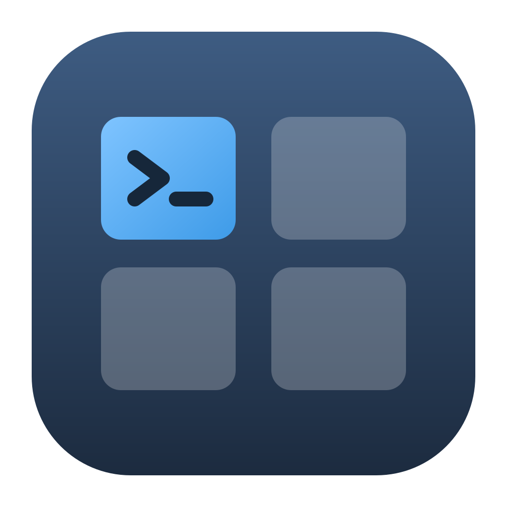
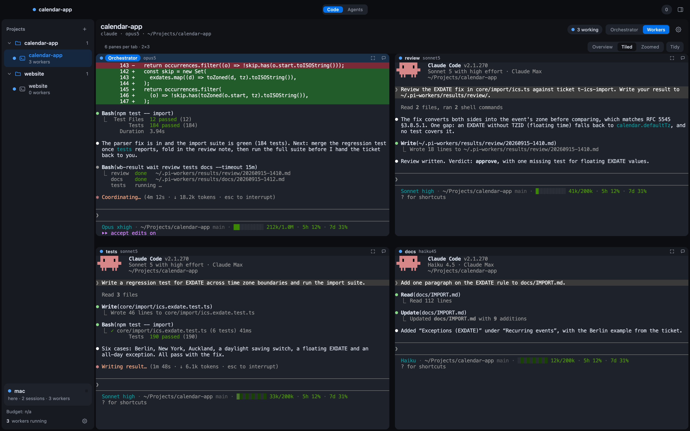
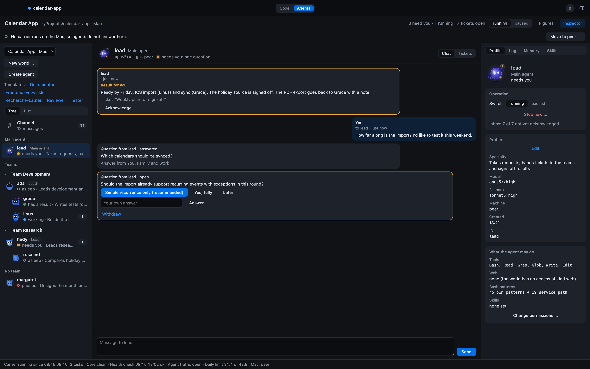

# agent-workbench

**A desktop workbench for coding agents that work as a team.** One lead session plans, delegates
and verifies; worker panes do the work in parallel; and on the Agents tab, long-lived agents with a
profile, a memory and a specialty take tickets, talk in a channel and only come to you with the
questions that are yours to answer.

<br clear="left">

<p align="center"></p>

<p align="center"></p>

Both pictures are screenshots of the app itself at its normal size, taken with a demo project: the
terminal panes replay an invented session, and nothing in them belongs to a real machine.

## What it is

- **Two tabs, one program.** *Code* is the orchestrator's place: sessions on the left, the lead
  pane or a grid of worker panes in the middle. *Agents* is where autonomous agents live: worlds
  per project, a main agent, teams with leaders and members, tickets in six states, a channel,
  direct chats, questions to you with an answer that lands where the agent reads it.
- **Everything is a live view on tmux.** The window drives tmux over its control mode, so the
  same sessions are reachable from a terminal on the same machine or over SSH from another one.
- **Not tied to one vendor.** Claude Code, Codex, aider, opencode and local models via Ollama are
  entries in a JSON registry. A setup with no account at all is a supported path: Ollama plus the
  local worker lane runs on your own hardware.
- **Agents you create by talking.** A new agent starts from a form or from a conversation with a
  model that asks what the agent should do, in what tone, with which tools, and fills the profile
  and its instruction file as you go. Both ways end in the same draft; you check it and create it.
- **Worlds on the machine that runs them.** A world can live on a second machine; the window reads
  and writes it over SSH, wakes the agents' carrier after every message, and says when the
  machine is out of reach. Moving a world there is one command.
- **Guards instead of hope.** A context guard makes a worker write a handoff before its context
  runs out. A result protocol makes you wait on a file, not on what a pane looks like. Agents run
  with a tool list and a Bash pattern list from their profile, enforced by hooks, not by prompt.

## The three repositories

| Repository | What it is | Take it if |
|---|---|---|
| **agent-workbench** (this one) | The window, the core and the tools it needs to run | you want the workbench and bring your own agent configuration |
| **[agent-workbench-mac](https://github.com/<your-github-user>/agent-workbench-mac)** | A native macOS shell (SwiftUI and AppKit) around the same core | you are on a Mac and prefer a real application over an Electron window |
| **[agent-setup](https://github.com/<your-github-user>/agent-setup)** | The whole setup: rules, skills, hooks, roles, an empty knowledge vault, and the workbench | you want the setup as it is actually used |

All three are built from the same private source tree by the same script, so they do not drift
apart. `<your-github-user>` stands for the account these repositories are hosted under. It is a
placeholder on purpose: the tool that extracts this repository from a working machine removes
account names everywhere, and it cannot tell the account in a public URL from the one on the
machine. The address bar you cloned from shows which one it is.

## What is in here

```
app/         the workbench itself — Electron main process, preload bridges, renderer, and
             awb-ctl, a dependency-free CLI that talks to the running program over a socket
extension/   16 modules the app imports rather than duplicates. They started life in a
             VS Code extension and still carry its directory name; there is exactly one copy
             of each, and this is it
shell/       118 command-line tools: worker spawners, context guard, model registry,
             session management, budget and quota, the agents' data library and carrier,
             cross-machine helpers. Which of them ship here is worked out at build time — the
             tools the app itself calls, plus everything those call in turn — because a
             hand-kept list is right until the day somebody adds a call and forgets the list
claude/roles/  the two role prompts, one for the lead session and one for a worker. They are
             what makes a pane behave like part of a workbench instead of a lone agent
claude/statusline-command.sh  the status line the lead session prints
assets/      the icon and the two preview pictures above
INSTALL.md   how to put all of it on your machine
```

## What is deliberately not in here

None of this is missing by accident, and none of it is needed to start the program:

- **Agent rules and skills** (`claude/regeln/`, `claude/skills/`) — the working agreements a
  session reads before it acts.
- **Hooks and slash commands** (`claude/hooks/`, `claude/commands/`) — the guards that refuse a
  secret on a command line, a `pkill` pattern wide enough to hit someone else's process, or a
  commit nobody asked for.
- **Templates for `CLAUDE.md` and `settings.json`** — the contract every agent reads, and the
  wiring that binds each hook to the event it runs on.
- **The knowledge base skeleton** and the tooling that indexes and searches it.
- **Worked examples** of a project rule file, a note, and an `AGENTS.md`.
- **The native Mac shell** — its own repository, see above.

All of the first five are in **[agent-setup](https://github.com/<your-github-user>/agent-setup)**.
Without the hooks and the settings that wire them up, the workbench runs and the guards do not
exist — worth knowing before you rely on them.

## What you have after installing

- **A workbench window** with your sessions on one side and every worker pane visible at once,
  in light or dark, in English or German.
- **Workers you spawn by name and model.** `claude-worker review sonnet5:high ~/project "…"`
  opens a pane, waits until the harness is genuinely ready, delivers the task, and checks that it
  was received. The same name later means the same pane with the same context.
- **An Agents tab** where a world's agents work through tickets on their own, on a carrier that
  wakes them when a message or a ticket arrives and lets them sleep otherwise. The carrier needs
  systemd, so agents run on a Linux machine; the window can be anywhere.
- **A context guard** that watches how full each pane's context is, makes a worker write a
  handoff before it runs out, compacts it, and sends it back to work. Nothing can compact
  itself, and an agent with a full context does not fail loudly — it quietly gets worse.
- **A result protocol.** Every worker writes its outcome to a file, and you wait on the file
  rather than on what the pane looks like. A spinner is not a status.
- **A model registry.** Harnesses, providers and models are JSON. `wb-state models discover`
  imports whatever your installed CLIs currently offer, so a model you just pulled shows up on
  its own.

## Requirements

| Needed | Why |
|---|---|
| git, tmux, python3, rsync | the tools are built on them |
| Node.js 22 or newer | the workbench is an Electron program and is built from source |
| At least one agent CLI | otherwise there is nothing to orchestrate |
| A subscription or API key | only for cloud harnesses |
| Ollama and a local model | only for the local lane — roughly 6 GB for a small model |
| A Linux machine with systemd | only for the Agents tab's carrier; the window itself runs on macOS and Linux |
| WSL2 on Windows | tmux has no native Windows equivalent |

## Honest limitations

- **The role prompts, the agents' instruction files and the code comments are in German.** The
  window speaks English or German; the texts an agent reads do not, yet. Any agent translates
  `claude/roles/` in one pass.
- **Some tools describe a two-machine setup that is not yours.** `wb-sync-setup`,
  `wb-shot-remote` and `wb-ssh-worker` assume a second host reachable over SSH, and
  `wb-modell-proxy` assumes a local model server on it. They are inert without one, and the
  hostnames in them are placeholders you have to fill in. The same goes for the launchd property
  list in `shell/`: it carries a literal `$HOME`, which launchd does not expand, so substitute it
  before you load it.
- **Sending mail is not here.** The tools that did it named the account and the place their
  credentials live, as values in the file rather than as a description, so neither is shipped.
  The rule that governs sending survives in the role prompts: an agent drafts, a person releases.
- **Any file that names a tool this repository does not carry says so** in a note at the end,
  added while the repository was built. Nothing has to be cross-checked by hand.
- **The registry ships with the harnesses that were actually measured** on macOS and Linux. A
  harness you add yourself needs its ready pattern measured once with `wb-harness-probe` —
  a guessed pattern produces workers that receive nothing and never say so.
- **Windows is untested.** The tools assume a POSIX shell and tmux; WSL2 is the path, and nobody
  has walked it end to end.
- **No telemetry, no phone-home, no bundled credentials.** There are no keys and no personal data
  in this repository. It is mechanics only.

## Getting started

Read [INSTALL.md](INSTALL.md). Handing that file to a coding agent and telling it to work through
the steps is a reasonable way to do it, and it is how the setup is meant to spread.

## License

AGPL-3.0-only. See [LICENSE](LICENSE).
